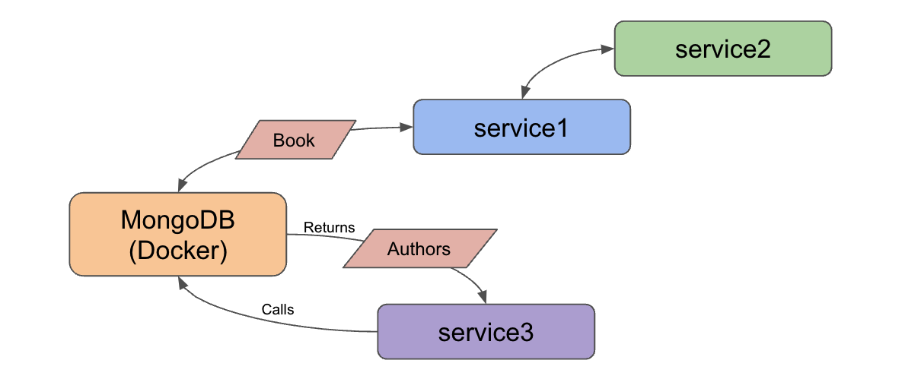

= Microservices Project: Level 4

This project is part of a series for creating microservices. In this repository, we use the following technologies:

* Spring Boot
* Java
* REST services
* Lombok
* MongoDB document database
** running in Docker container
** loaded with Book/Author domain data

For the domain, we loaded a publicly-available https://sites.google.com/eng.ucsd.edu/ucsdbookgraph/home?authuser=0[UCSD Book Graph dataset^] that provides books and related information.

== Architecture

We have 3 services in this repository: `service1`, `service2`, and `service3`. Our architecture has changed slightly from the previous https://github.com/JMHReif/microservices-level3[Level3^], as we have added a new service for book authors. Responsibilities of each service are outlined below.

* Service1: backend service for interacting with stored data (MongoDB database in Docker container) and hosting the REST api endpoint (`localhost:8080/db/books`)
* Service2: client service for calling the available REST endpoint(s) from Service1 and returning any results (books)
* Service3: backend service for interacting with stored data (MongoDB database in Docker container) and hosting the REST api endpoint (`localhost:8082/db/authors`)

With all three services running, we can use service2 to call service1 for the books backend, and separately call service3 from the command line for the authors backend.

== Microservices functions

There are a variety of reasons businesses and users might choose to develop applications in a microservices architecture. Some potential reasons are listed below.

* Scalability
* Functionality independence (separating grouped features, often for reliability)
* Maintenance simplicity (changes only affect pieces, and less likely to impact whole)
* Shift resource load (from large instance running single monolith application, to many smaller instances hosting/coordinating microservices)

== Executing the services

To reproduce this intro example, please follow the steps.

1. Clone this repository
2. Run each service (either from an IDE or command line)
3. Open a browser and access one of the nested endpoints (`localhost:8080/db/books` or `localhost:8082/db/authors`).
4. See the results of books or authors appear :)

//== Content

//* Blog post: https://jmhreif.com/blog/microservices-level4/[Microservices Level 4^]

== Previous steps

* https://github.com/JMHReif/microservices-level1[Level1] - Sending a string message from one Spring Boot app to another
* https://github.com/JMHReif/microservices-level2[Level2] - Retrieving prepopulated Book data from one Spring Boot app to another
* https://github.com/JMHReif/microservices-level3[Level3] - Storing Book data in MongoDB and retrieving all stored books