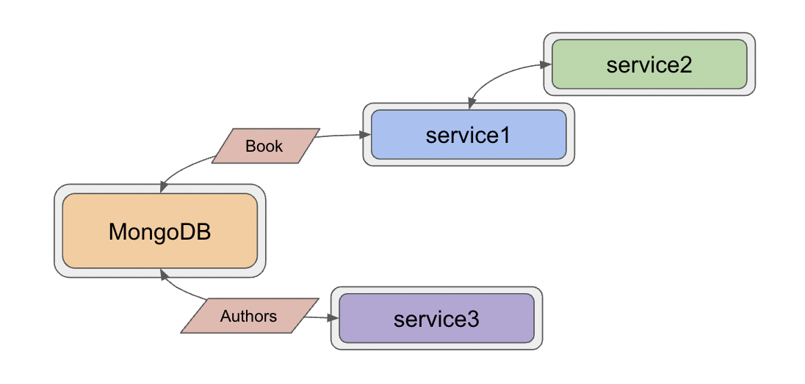

= Microservices Project: Level 5

This project is part of a series for creating microservices. In this repository, we use the following technologies:

* Spring Boot
* Java
* REST services
* Lombok
* MongoDB document database
** loaded with Book/Author domain data
* Docker and docker compose

For the domain, we loaded a publicly-available https://sites.google.com/eng.ucsd.edu/ucsdbookgraph/home?authuser=0[UCSD Book Graph dataset^] that provides books and related information.

== Architecture

We have 3 services in this repository: `service1`, `service2`, and `service3`. Our architecture hasn't changed from the previous https://github.com/JMHReif/microservices-level4[Level4^], but how we are running the applications has. Responsibilities of each service are outlined below, followed by the changes to execution.

* Service1: backend service hosting the REST api for book data
* Service2: client REST service for calling service1 and returning books
* Service3: backend service hosting the REST api for author data

Each of the applications has been packaged into a Docker container, and we are using https://docs.docker.com/compose/[Docker Compose^] to run and manage the services together. With all services running in Docker containers, there were a few configuration changes needed, but the applications can communicate and pass data as before.

== Microservices functions

There are a variety of reasons businesses and users might choose to develop applications in a microservices architecture. Some potential reasons are listed below.

* Scalability
* Functionality independence (separating grouped features, often for reliability)
* Maintenance simplicity (changes only affect pieces, and less likely to impact whole)
* Shift resource load (from large instance running single monolith application, to many smaller instances hosting/coordinating microservices)

== Executing the services

To reproduce this intro example, please follow the steps.

1. Clone this repository
2. Build each service's Docker container (note: if not on arm64 silicon chip, will need to update image names in compose file, as well).
3. Execute Docker compose with `docker-compose up -d`.
4. Test backing service (books): Open a command line window and execute `curl localhost:8081/db/books`.
5. Test client service: Open a command line window and execute `curl localhost:8080/goodreads/books`.
6. Test backing service (authors): Open a command line window and execute `curl localhost:8082/db/authors`.
7. See the results of books or authors appear :)

//== Content

//* Blog post: https://jmhreif.com/blog/microservices-level5/[Microservices Level 5^]

== Previous steps

* https://github.com/JMHReif/microservices-level1[Level1] - Sending a string message from one Spring Boot app to another
* https://github.com/JMHReif/microservices-level2[Level2] - Retrieving prepopulated Book data from one Spring Boot app to another
* https://github.com/JMHReif/microservices-level3[Level3] - Storing Book data in MongoDB and retrieving all stored books
* https://github.com/JMHReif/microservices-level4[Level4] - Adding new service for author data