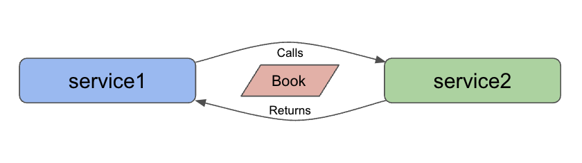

= Microservices Project: Level 2

This project is a follow-up project for the microservices-level1 repository for creating microservices. In this repository, we use the following technologies:

* Spring Boot
* Java
* REST services
* Lombok
* MongoDB document database (embedded) with Book data

We have added domain data on books because most applications interact with some form of data storage. Spring Data MongoDB is one option that requires a only few steps, and using the embedded version (via a test dependency), we avoid spinning up a separate instance and creating an additional service...for now.

For the domain, we are using pre-populated data for some of my favorite books that get saved to the embedded database when the application is started. While the data is hard-coded for our embedded test database, it gives us a first step toward interacting with stored data. One of our later goals will be to separate this embedded database to a service itself, populate it with more complete data, and handle typical operations (https://en.wikipedia.org/wiki/Create,_read,_update_and_delete[CRUD^]), more closely simulating the real business world.

== Architecture

We have 2 services in this repository: `service1` and `service2`. Our architecture is the same as the previous https://github.com/JMHReif/microservices-level1[Level1^]; however, what is different is the data we are passing. This project passes `Book` objects (previous one passed a string message). Responsibilities of each service are outlined below.

* Service1: backend service for storing data (embedded MongoDB database) and hosting the REST api endpoint (`localhost:8080/db`)
* Service2: client service for calling the available REST endpoint (`localhost:8080/db/books`) and returning any results (4 books)

With both services running, we can use service2 to execute whatever service(s) created on the backend (service1).

== Microservices functions

There are a variety of reasons businesses and users might choose to develop applications in a microservices architecture. Some potential reasons are listed below.

* Scalability
* Functionality independence (separating grouped features, often for reliability)
* Maintenance simplicity (changes only affect pieces, and less likely to impact whole)
* Shift resource load (from large instance running single monolith application, to many smaller instances hosting/coordinating microservices)

== Executing the services

To reproduce this intro example, please follow the steps.

1. Clone this repository
2. Run each service (either from an IDE or command line)
3. Open a browser and go to `localhost:8080/db/books` OR open a command line window and execute `curl localhost:8080/db/books`.
4. See the results of my favorite books appear :)

//== Content

//* Blog post: https://jmhreif.com/blog/microservices-level1/[Microservices Level 1^]

== Previous steps

* https://github.com/JMHReif/microservices-level1[Level1] - Sending a string message from one Spring Boot app to another