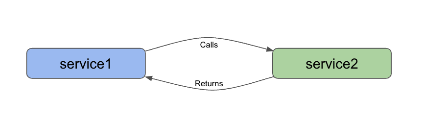

= Microservices Project: Level 1

This project is intended to be the first (of many) steps in creating a microservices project. In this repository, we use the following technologies:

* Spring Boot
* Java
* REST services
* Lombok

== Architecture

We have 2 services in this repository: `service1` and `service2`. Responsibilities of each service are outlined below.

* Service1: backend service for hosting the REST api endpoint (`localhost:8080/text`)
* Service2: client service for calling the available REST endpoint (`localhost:8080/text`) and returning the result (`Hello, World!`)

With both services running, we can use service2 to execute whatever service(s) created on the backend (service1).

== Microservices functions

There are a variety of reasons businesses and users might choose to develop applications in a microservices architecture. Some potential reasons are listed below.

* Scalability
* Functionality independence (separating grouped features, often for reliability)
* Maintenance simplicity (changes only affect pieces, and less likely to impact whole)
* Shift resource load (from large instance running single monolith application, to many smaller instances hosting/coordinating microservices)

== Executing the services

To reproduce this intro example, please follow the steps.

1. Clone this repository
2. Run each service (either from an IDE or command line)
3. Open a browser and go to `localhost:8080/text` OR open a command line window and execute `curl localhost:8080/text`.
4. See the results `Hello, World!` appear :)